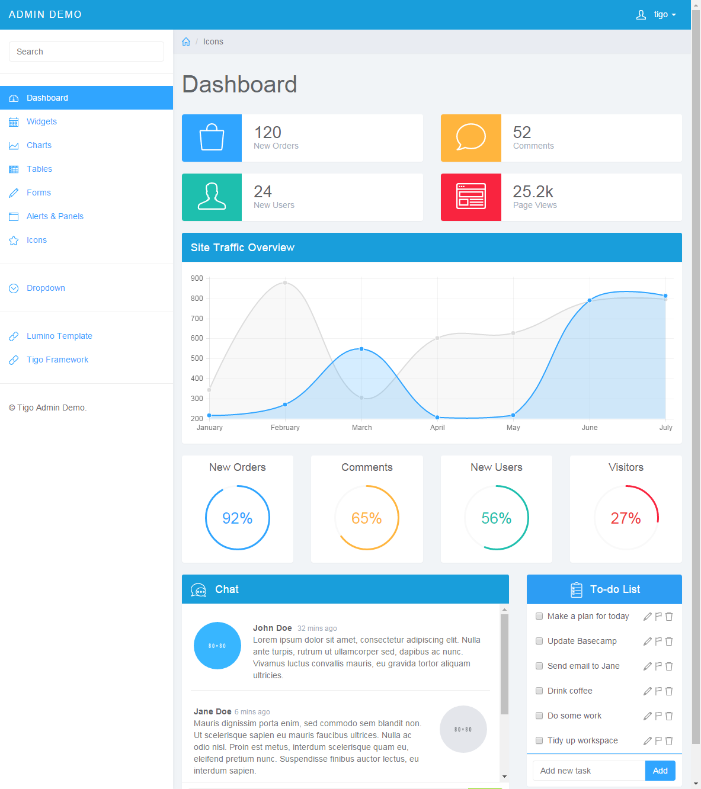
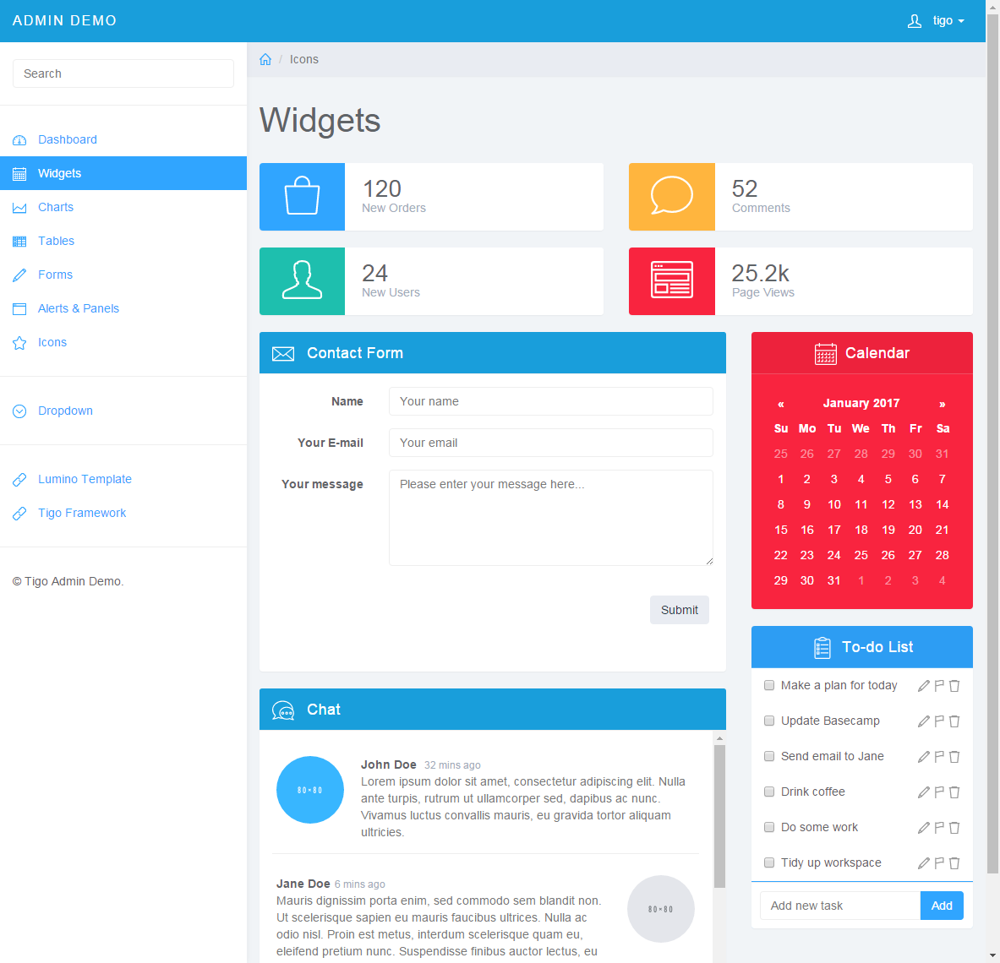
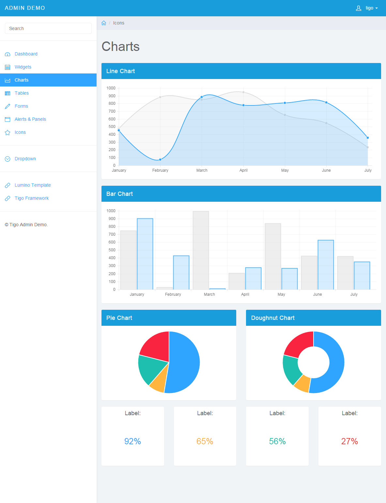

# Tigo-admin

tigo-admin is a admin template demo with tigo and Lumino, which is a clean, fresh admin panel template built on the Bootstrap framework and available.

# Usage

1.Install tigo.
```
go get github.com/foolin/tigo
```

2.Download [tigo-admin](https://github.com/foolin/tigo-admin/archive/master.zip "Tigo admin").

3.Run admin server.
```
go run main.go
```

You should be able to access URLs such as `http://localhost:8080`.

# Screenshots

* /login


* admin/index


* admin/widgets


* admin/charts


* admin/tables


* admin/forms


* admin/panels


* admin/icons


# Links

* [Tigo Framework](https://github.com/foolin/tigo "tigo framework")

* [Lumino Admin Template](http://medialoot.com/item/lumino-admin-bootstrap-template/ "Lumino Admin Template")